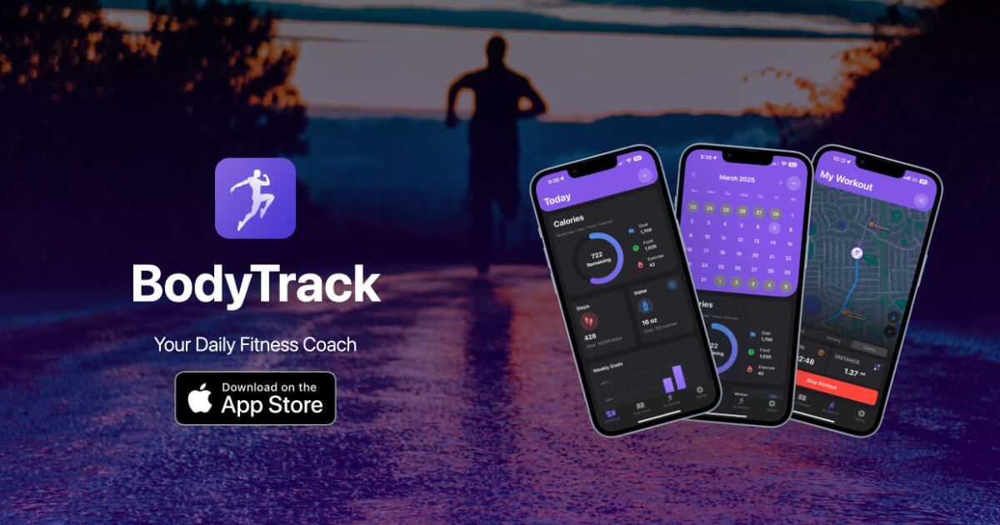

# BodyTrack: Fitness Tracker

<!-- add the assets/img/og-image.jpg -->

## Description
BodyTrack is a 100% free fitness and health-tracking app designed to help users monitor their daily calorie intake, exercise, water consumption, and weight progress. The app integrates with HealthKit to provide real-time tracking of active energy (calories burned) and steps taken.

## Features
- Track daily calorie intake
- Track daily exercise
- Track daily water consumption
- Track daily weight progress
- Real-time tracking of active energy and steps taken
- View daily, weekly progress

## Technologies
- SwiftUI
- Core Data
- HealthKit
- Location Services
- Local Notifications

## AppStore
- [BodyTrack: Fitness Tracker](https://apps.apple.com/app/bodytrack-calories-tracker/id6742031983)
